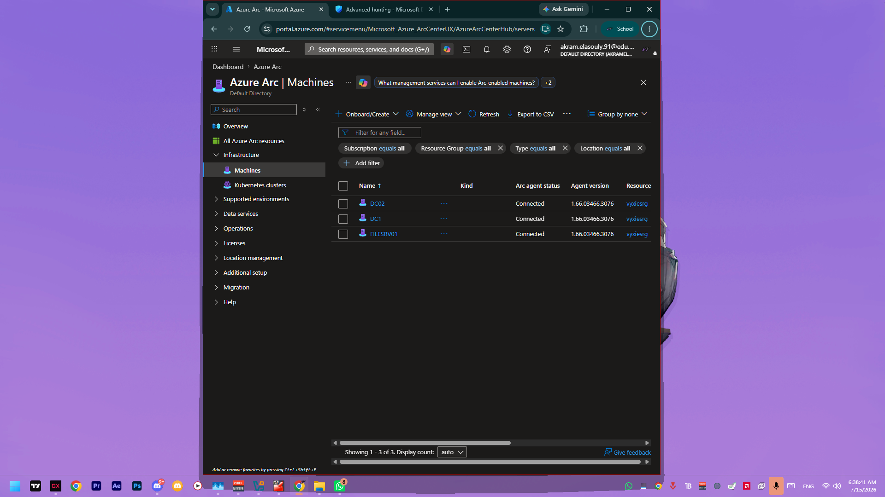
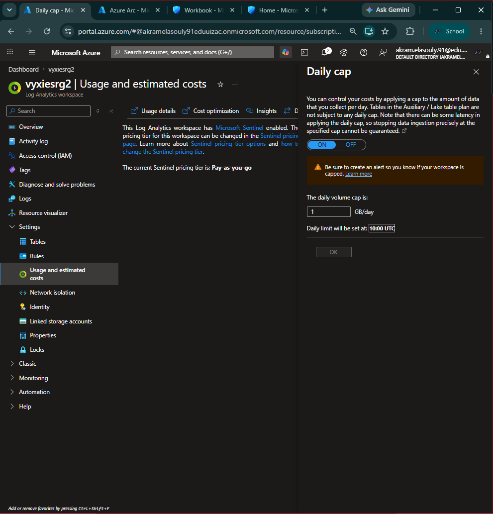
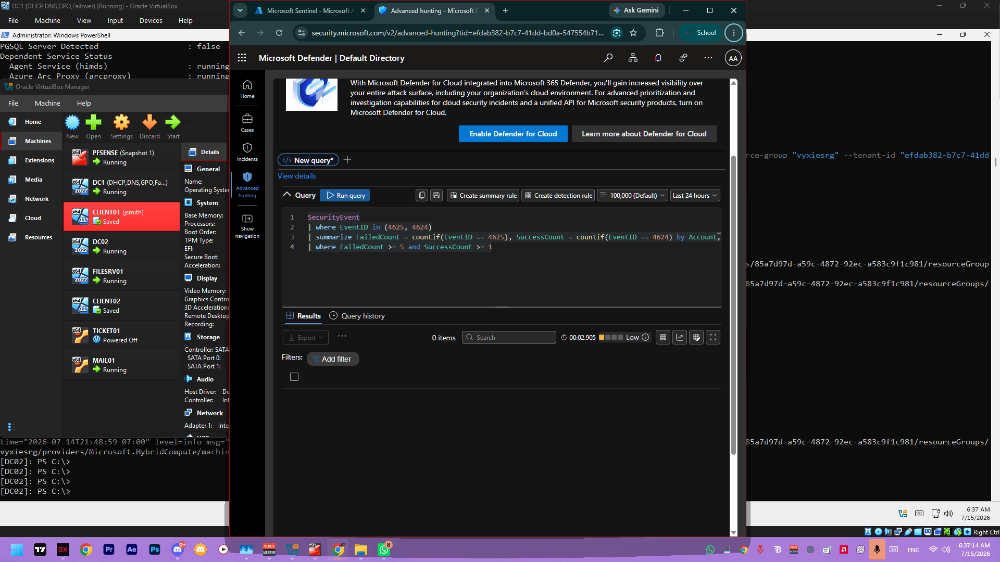

# SIEM with Microsoft Sentinel (Azure Arc Hybrid)

## Problem
Simulates a small MSP needing centralized security visibility across a multi-server Windows environment, rather than checking each machine's local event log individually.

## What I Built
- Log Analytics workspace + Microsoft Sentinel enabled (Azure for Students)
- Daily ingestion cap set to 1GB/day as a cost safety net
- DC01, DC02, and FILESRV01 onboarded to Azure via **Azure Arc**, enabling hybrid cloud management of on-prem servers
- Windows Security Events flowing from DC01/DC02 into Sentinel via Azure Monitor Agent
- A workbook with a failed-logon (EventID 4625) time-series detection query, broken down by computer
- A second detection identifying brute-force patterns (5+ failed logons followed by a success), built in Advanced Hunting
- Confirmed EventID 4625 auditing enabled at the OS level and validated against real local Security log data on DC01

## Lab Context
- **Cloud layer:** Azure Log Analytics + Microsoft Sentinel
- **Hybrid connector:** Azure Arc for on-prem Windows server onboarding
- **Ingested sources:** Security events from DC01/DC02 (and Arc-connected FILESRV01 for hybrid manageability)
- **Detection scope:** Authentication-focused detections (high-volume failures and failure→success patterns)

## How It Works


*DC01, DC02, and FILESRV01 all showing Connected in Azure Arc — the hybrid management layer that makes on-prem servers visible to Sentinel.*


*Ingestion cost control, set before any real data collection began.*

**Detection 1 — Failed logon time series:**
```kql
SecurityEvent
| where EventID == 4625
| summarize FailedLogons = count() by bin(TimeGenerated, 15m), Computer
| render timechart
```
See `kql-detections/failed-logons.kql`.

**Detection 2 — Brute-force pattern (failures followed by a success):**

```kql
SecurityEvent
| where EventID in (4625, 4624)
| summarize FailedCount = countif(EventID == 4625), SuccessCount = countif(EventID == 4624) by Account, Computer
| where FailedCount >= 5 and SuccessCount >= 1
```
See `kql-detections/brute-force-success.kql`. This flags accounts with 5+ failed logons followed by at least one success — a stronger signal than raw failure counts alone, since it isolates attempts that actually succeeded after repeated guessing rather than lockouts or typos.

## Challenges & Troubleshooting
- **DC02 showed Offline in Azure Arc despite onboarding appearing to succeed.** Root cause was a three-layer chain: a stale IPv6 DNS fallback broke all external resolution, which left the Arc agent's credential/token exchange permanently wedged even after DNS was fixed, which then required a clean disconnect/reconnect — which itself hit an RBAC permission gap on the reconnecting account (missing the "Azure Connected Machine Resource Administrator" role), and a resource-name conflict from an earlier orphaned disconnect. Each layer had to be diagnosed and fixed independently before the machine would show Connected.
- **Linux Arc onboarding (planned for pfSense syslog forwarding) was blocked by a genuine platform-support gap**, not a configuration error: the lab's Ubuntu 26.04 VMs aren't yet in Azure Arc's supported OS list, confirmed directly from Microsoft's own official onboarding script output (`unsupported Linux distribution: Ubuntu:26.04`). Rather than reinstalling working, in-progress VMs just to satisfy this requirement, this was documented as a known platform limitation and scoped out.
- **Default Domain Controllers Policy's GPO Edit permissions became unexpectedly locked** mid-session (Edit greyed out across multiple UI paths, despite confirmed Domain Admin rights). Worked around by setting the audit policy directly via `auditpol` on DC01 rather than through Group Policy, to unblock detection testing without losing more time to the GPO console itself.

## Validation Performed
- Verified Arc connection state for Windows server targets in Azure
- Verified security-event ingestion path from domain controllers into Sentinel
- Verified both KQL detections execute and return expected signal types
- Verified audit-policy dependency on source servers using local Security log checks

## What I'd Do Differently / Next Steps
- Extend the audit policy fix to DC02 (and properly resolve the underlying GPO permissions issue) to guarantee failed-logon tests land in scope regardless of which DC handles authentication via load-balancing
- Revisit Linux Arc onboarding once Ubuntu 26.04 support lands, to complete pfSense syslog ingestion
- Build out additional detections (privileged group membership changes, pfSense deny-spike) once syslog is unblocked
- Trigger and formally triage one real incident end-to-end through Sentinel's incident workflow
