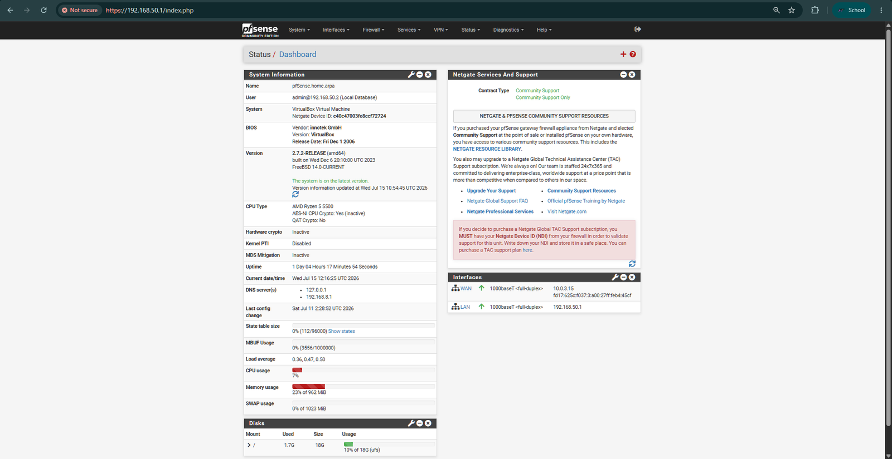
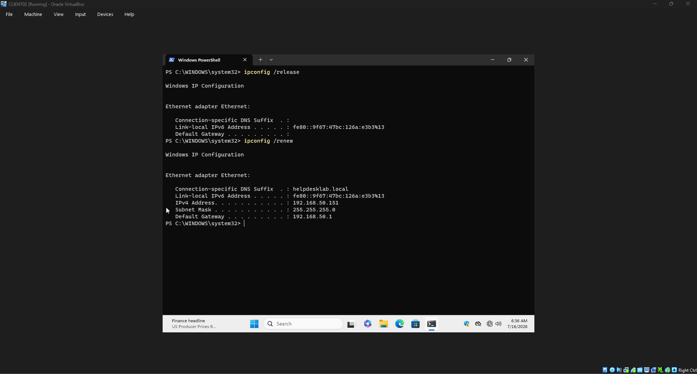
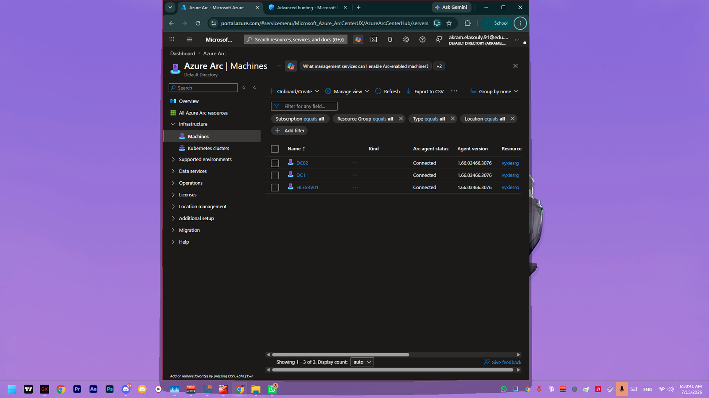
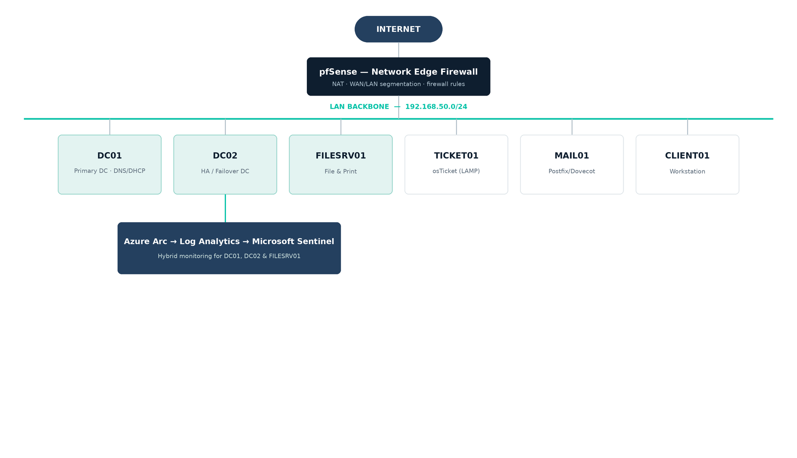

# HelpDeskLab / IT Support & Infrastructure Portfolio

**Akram El Asouly**  IT Support Professional · Morocco
📧 [AkramEIAsouly@proton.me](mailto:AkramEIAsouly@proton.me) &nbsp;|&nbsp; 🎓 Google IT Support Professional Certificate

     

A self-built, multi-server IT infrastructure lab simulating a real small-business / MSP client environment. Built end-to-end in VirtualBox: network edge, Active Directory with high availability, file/print services, a ticketing system, a mail server, and a live SIEM with hybrid cloud management via Azure Arc.

Every project below includes real screenshots, configuration details, and an honest account of what broke and how it was diagnosed. Not just a clean happy-path walkthrough. That diagnostic process, more than any single service, is the point of this repo.

---

## About me

I hold the **Google IT Support Professional Certificate** and am based in **Morocco**, currently looking for IT Support / Junior Sysadmin roles. I built HelpDeskLab to go beyond scripted tutorials: seven services that actually depend on each other on one network, with the kind of subtle, multi-layered failures a real environment produces. Traced to root cause with logs and debug output rather than guesswork.

Reach me at **[AkramEIAsouly@proton.me](mailto:AkramEIAsouly@proton.me)**.

## Quick look

<table>
<tr>
<td> pfSense edge dashboard</td>
<td> Domain controller failover test</td>
<td> Hybrid monitoring with Azure Arc</td>
</tr>
</table>

## What this portfolio shows

The lab is built around one simple idea: an environment should behave like a small business or MSP client setup, with services that depend on each other and problems that do not show up in a clean walkthrough.

### Architecture overview

Everything sits on one lab network, behind one firewall:

pfSense is the edge every other server sits behind on `192.168.50.0/24`. DC01, DC02, and FILESRV01 are additionally onboarded to Azure via Arc, feeding a Log Analytics workspace that Microsoft Sentinel monitors.

## Lab environment at a glance

| Layer | Components |
|---|---|
| Virtualization | VirtualBox-hosted multi-VM lab |
| Edge/network | pfSense dual-interface edge (`WAN` + `LAN`) |
| Identity core | DC01 + DC02 (AD DS, DNS, DHCP failover) |
| Business services | FILESRV01 (shares/print), TICKET01 (osTicket), MAIL01 (Postfix/Dovecot/Roundcube) |
| Security monitoring | Azure Arc + Log Analytics + Microsoft Sentinel |
| Internal subnet | `192.168.50.0/24` |

## How to read this portfolio

- Start with the **Projects** table for a quick capability map.
- Open each module folder for implementation detail and screenshots.
- Use each module's **Challenges & Troubleshooting** section to see real diagnostic workflow.
- For security monitoring specifics, use `09-siem-sentinel/kql-detections` for detection logic.

## Projects

1. [01-firewall-pfsense](./01-firewall-pfsense)
   Built the network edge with pfSense, covering routing, NAT, firewall rules, and interface layout.

2. [02-ad-domain-lab](./02-ad-domain-lab)
   Set up an Active Directory environment with OUs, security groups, GPOs, and NTFS permissions, then worked through issues that were not obvious at first glance.

3. [03-second-dc-ha](./03-second-dc-ha)
   Added a second domain controller and tested failover by taking one offline. The troubleshooting there became one of the most useful parts of the project.

4. [04-file-print-server](./04-file-print-server)
   Built shared storage and printer deployment, then worked through problems caused by stale configuration and migration gaps.

5. [05-ticketing-system](./05-ticketing-system)
   Installed and configured osTicket on a LAMP stack, including the kind of service issues that only show up when you actually use the system.

6. [06-mail-server](./06-mail-server)
   Set up mail delivery and webmail, then traced a case where the mailbox looked broken even though the mail flow itself was working.

7. [09-siem-sentinel](./09-siem-sentinel)
   Connected servers to Azure Arc and built detection logic in Microsoft Sentinel, with a focus on actual monitoring rather than theory.

## What I care about most

I am more interested in the real troubleshooting process than in showing a perfect end state.

- Finding the root cause rather than guessing from symptoms
- Reading logs, service behavior, and configuration details carefully
- Testing failures instead of only documenting successful setups
- Writing down what was learned, even when the fix was not obvious

## Two examples of the work

### The DC rename cascade

Renaming a domain controller during the lab caused a chain of separate failures that had to be diagnosed one by one. The issue was not a single misconfiguration; it was a series of hidden dependencies that only became visible when the environment was tested.

[Read the full breakdown in 03-second-dc-ha](./03-second-dc-ha)

### Chasing a ghost in the mailbox

A mail client reported an inbox error even though mail delivery was working. The answer was not in the obvious places first; it was found by following the actual path of the mail and inspecting the service logs in detail.

[Read the full breakdown in 06-mail-server](./06-mail-server)

## Core skills

- Windows Server, Active Directory, DNS, DHCP, GPOs, and NTFS permissions
- Networking, firewalling, routing, and segmentation with pfSense
- Linux administration, including web services and mail infrastructure
- Azure Arc, Microsoft Sentinel, and basic detection engineering
- Troubleshooting with logs, configuration review, and systematic isolation of problems

## Contact

Email: [AkramEIAsouly@proton.me](mailto:AkramEIAsouly@proton.me)

## Notes on scope

Two originally-planned modules, VLAN segmentation and scripted endpoint hardening; were deliberately scoped out due to time, in favor of finishing the seven services above to a high standard rather than spreading thinner across nine. Everything listed in the table was fully built, tested, and documented.

## About this lab

Built solo, VM-to-VM, using VirtualBox for every server. The goal was to reproduce the kind of infrastructure a small business or MSP client environment would actually run, and to practice diagnosing and fixing real issues along the way — rather than following a scripted tutorial.

---

📧 **[AkramEIAsouly@proton.me](mailto:AkramEIAsouly@proton.me)** · Morocco · Open to IT Support Specialist / Junior Sysadmin / Helpdesk Technician roles
